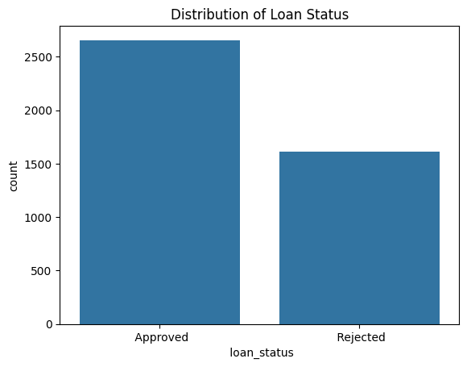

# Loan Preapproval Prediction (Logistic Regression + XGBoost)

## 🔎 Project Overview

A classification model to predict whether a loan application should be approved or rejected based on various financial and demographic features. First I tried using logistic regression as a basic model, and then moved onto XGBoost, a state-of-the-art boosting method. This will be the final project to complete my data analytics certificate, and the motivation behind it was my experience working as a bank teller and gauging people's eligibility for a loan on a daily basis.

---

## 📊 Dataset

The dataset used to train these models comes from Kaggle user architsharma01, and can be accessed [here](https://www.kaggle.com/datasets/architsharma01/loan-approval-prediction-dataset). It contains categorical as well as quantitative variables that are usually considered when looking at a member's approval rate for a loan application. Some of the features this dataset has are:

- **Number of dependents**
- **Graduate status**
- **Employment status**
- **Annual income**
- **Loan amount**
- **Loan term**
- **Credit score**
- **Assets value**

## 📚 Tools & Libraries

- **Pandas**
- **NumPy**
- **Scikit-learn**
- **XGBoost**
- **Matplotlib / Seaborn**

---

## 🔍 Problem Statement

Lenders want to reduce risk by only approving applicants who are most likely to repay their loans. The goal was to build a classification model that minimizes **false approvals** while still capturing the majority of valid ones.

---

## 🧠 Preprocessing and EDA

I plotted the class balance for our target variable, **loan status**, and found that my dataset was fairly imbalanced, with 2656 records belonging to the positive (**Approved**) class and 1613 belonging to the negative (**Rejected**) class. I also looked for null values and duplicate values and found none. Outlier detection was performed by defining a function that uses the IQR method, and percentage of outliers in numerical columns was extremely low, so I left them in the dataset. Finally, categorical data was encoded binarily using mapping and quantitative features were scaled using StandardScaler.

## 📌 Feature selection

After a correlation analysis was conducted, it was concluded that by far credit score is the most important feature for our model's prospective prediction power, with a correlation of 77% with loan status. Almost every feature except for loan ID, number of dependents, and graduate status was kept. This decision came down to the feature correlation analysis as well as business intelligence and my interpretation of the lending services provided at my current institution.

---

## 🧩 Model Testing & Evaluation

Training and testing split was 80/20, and it was also stratified to account for the target variable class imbalance. Cross-validation was also run on both models using StratifiedKFold at 5 splits.

**Logistic Regression**

For this model, I picked 1000 iterations, and I achieved 92% accuracy with 22 false positives (FPs) and 41 false negatives (FNs), with a 96% precision score on the positive class. After adjusting the threshold to 0.6 to prioritize precision and get fewer FPs (10) at the expense of more FNs, precision score went up to 98%. I also plotted the ROC curve and the ROC-AUC score was 93%.

**XGBoost**

Since this was my first time dabbling into XGBoost, I used ChatGPT as support when creating this model. RandomizedSearchCV was used to find the best hyperparameters again with the previously stated StratifiedKFold for cross-validation. Once again I also adjusted the threshold to prioritize precision and after evaluating, this classifier had 98% accuracy, only 8 FPs and 7 FNs, and a precision score of 98% for the positive class. The ROC-AUC score was raised from 93% to 98%, so in terms of improvement for a loan approval prediction model, this boosting method performed significantly better than the basic logistic regression model, as expected.

---

## 🏁 Conclusion

This project showcases the ML workflow, from defining the problem and collecting the data, all the way to model training, testing, and tuning. Logistic regression was used at the beginning to get a baseline model, and then I moved onto a stronger, better model to increase performance. By adjusting the threshold for the tradeoff between precision and recall to minimize false positives, these models were aligned with real-world lender goals: reducing false approvals as well as financial risk.

Regarding the XGBoost classifier, with a final accuracy of 98%, precision of 98%, and a ROC-AUC score of 98%, this model provided highly reliable approval predictions. These results highlight how strategic feature selection & engineering, hyperparameter search & cross-validation, and ensemble method modeling can produce a classifier ready to make a real-world impact in the financial industry.

